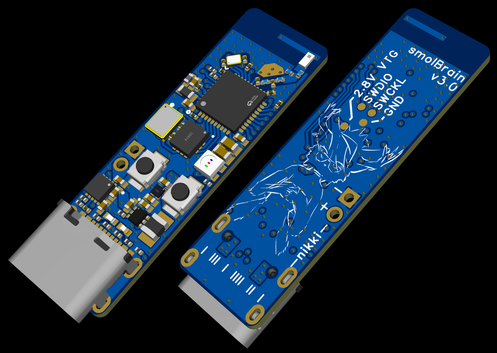
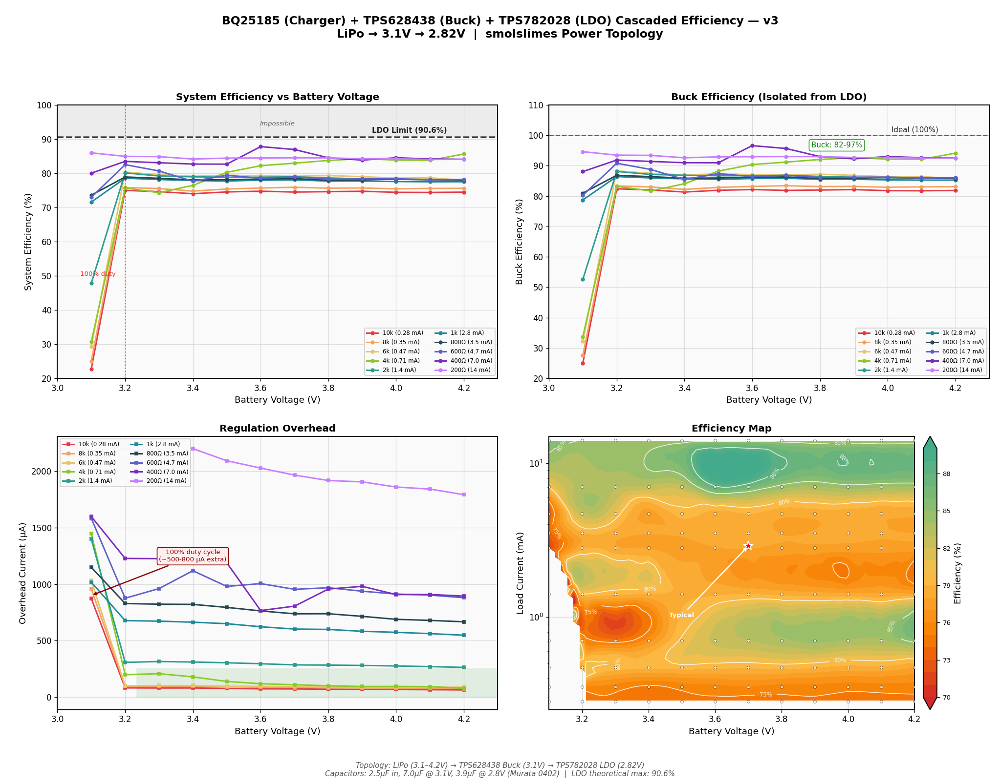

# smolBrain V3.0

A custom PCB for SlimeVR nRF trackers (smolslimes).

smolBrain is a fully integrated, 4-layer tracker board built around the nRF52833 and ICM-45686.

Every trace on this board was routed with care - proper return paths, low-noise layout, clean grounds, and as many signal integrity rules as I could follow. I tried to make it as small as possible while still being as properly designed as possible, and I paid zero attention to BOM cost :3. All signals on the board look super clean, every component is tested, and everything works as intended.

For general information on SlimeVR nRF trackers, firmware flashing, pairing, and calibration, see the official documentation: https://docs.slimevr.dev/smol-slimes/

---

## Contents

1. [Schematic](#1-schematic)
2. [Hardware](#2-hardware)
3. [Features](#3-features)
4. [Power consumption](#4-power-consumption)
5. [Flashing](#5-flashing)
6. [License](#6-license)

---

## 1. Schematic

I tried to put as much useful information into the schematic as I could. It's not just pinouts and component values - every block has notes explaining my reasoning, the measurements I took, and why I chose the values I did. It might look a little overwhelming at first, but the idea is that for each component you can see what my thought process was. Maybe it can be useful as a learning tool if you're designing something similar. It doesn't mean everything is perfect - there could be mistakes, and if you find any, feel free to let me know.

Bellow you can see just a preview what i have inside :3 [schematic PDF](Nikki_smolBrain_V3.0_schematic.pdf).

---

## 2. Hardware

| Component | Part |
|-----------|------|
| MCU | nRF52833 (QIAA, 73-pin aQFN) |
| IMU | ICM-45686 (6-axis, SPI) |
| TCXO | SiT1552 (32.768 kHz, ±10 ppm) |
| DCDC | TPS628438 (LiPo -> 3.1 V) |
| LDO | TPS7A2028 (3.1 V -> 2.8 V) |
| PCB | 4-layer stackup |
| Power rail | 2.8 V for all components |
| Battery | Single-cell LiPo (150 mAh typical) |

---

## 3. Features

- Precision TCXO clock for sensor sampling and TDMA synchronization
- LiPo charger with power path and overvoltage/undervoltage protection
- RGB LED for status indication
- Active battery divider with low-leakage design
- DCDC + LDO power topology for low ripple and low power consumption
- Small ceramic antenna
- SW0 button and reset button

### 3.1 Precision clock

External TCXO at 32.768 kHz, ±10 ppm. Feeds both the nRF (LFCLK) and the IMU (CLKIN), providing accurate timing for sensor sampling and TDMA synchronization during light sleep. The TCXO is controllable via a tri-state enable pin - firmware switches it off when the board enters deep sleep to save power.

TCXO current consumption is upto datasheet. ~7 uA with no load connected, around 12 uA with 1 MOhm load and around 1.3 uA when tri-state is down.

Since TCXO is used for nRF too - you must take care of proper switching to external and internal clock sourses. At the meoment i have a custom firmware but i believe in the future it will be properly implemented on the main branch of the smolSlimes.

### 3.2 Charger with power path and protection

LiPo charger with power path and overvoltage/undervoltage protection. 100 mA is the maximum current allowed through the system; maximum charging current is 40 mA. Two indicator LEDs near the USB-C port:

| LED | State | Meaning |
|-----|-------|---------|
| White | On | Charging |
| Both | Off | Already charged |
| White | Fast blinking | USB power connected but no battery - this is normal |
| Red | On (with or without white) | Fault - can be recoverable or non-recoverable, check charger datasheet |

### 3.3 RGB LED

Directly controlled by the nRF for status indication (pairing, calibration, battery level, errors, etc.).

### 3.4 Active battery divider

Battery voltage sensing through a 1 MΩ / 1 MΩ voltage divider. The divider uses an active low-side switch - the ground side of the lower resistor is connected to an nRF GPIO configured as an open-drain output. When the GPIO is released (high-Z), the divider is disconnected from ground, so there's no DC current path. There is still some leakage through the nRF pin's internal protection diode when the battery voltage exceeds VDD (2.8 V), but this leakage is much smaller than having the ground always connected.

### 3.5 Power topology

LiPo -> DCDC (3.1 V) -> LDO (2.8 V). The LDO stage produces an extremely clean power rail - below 1 mV peak-to-peak voltage ripple, plus whatever residual DC offset remains from the DCDC bias shift. This directly benefits IMU noise performance. In the scope capture below, yellow is the DCDC output (LDO input) and blue is the LDO output. The leftover ripple you see on the blue line is from the DCDC voltage bias, which depends on current consumption. The DCDC keeps its output just a bit above target when current consumption is low, so that when it spikes it doesn't drop the voltage too low. That change is too low frequency for the LDO to filter out, and it's more or less normal behavior.

### 3.6 Ceramic antenna

Small ceramic antenna matched to the nRF52833 RF output.

### 3.7 Buttons

SW0 button and reset button for user interaction and board recovery.

---

## 4. Power consumption

Measured at 4.0 V battery input with 150 mAh LiPo (0.6 Wh):

| Mode | Current | Power | Battery life (150 mAh) |
|------|---------|-------|------------------------|
| Active (200 TPS) | 2.88 mA | 11.52 mW | ~52 hours |
| Deep sleep | 13 µA | 0.052 mW | Months |

During actual use, the tracker isn't always transmitting at 200 TPS - the packet rate varies depending on how much you move, so real-world battery life will be longer than 52 hours.

Overall system efficiency is approximately 78% at typical operating loads. Efficiency is measured from the battery connector point, so this is how the battery sees the entire board with charger, DCDC, LDO, and all components on it.

---

## 5. Flashing

A blank nRF52833 requires an SWD debugger for the initial flash. There is no built-in bootloader on a new chip.

### 5.1 What you need

Any SWD-capable debugger. Options include:

- **nRF52833 DK** - use the on-board J-Link as an external debugger
- **Raspberry Pi Pico** - flash with picoprobe/debugprobe firmware (~$4)
- **Raspberry Pi Debug Probe** - CMSIS-DAP, plug-and-play (~$12)
- **J-Link EDU Mini** or any standalone J-Link
- **ST-Link V2 clone** - works with OpenOCD (~$3-5)

### 5.2 Connections

Four wires from the debugger to the smolBrain SWD header:

| Pin | Function |
|-----|----------|
| SWDIO | Serial Wire Debug data |
| SWDCLK | Serial Wire Debug clock |
| GND | Ground |
| VTG | Voltage sense (target voltage reference - does not supply power) |

The board must be powered independently - either through USB-C or with a battery soldered on. The VTG pin only tells the debugger what logic level to use (2.8 V on this board).

To connect the debugger, you can use a pogo pin clip - a spring-loaded clip with pogo pin contacts that press against the SWD pads without soldering. Adafruit sells these. Pitch must be 1.27 mm.

### 5.3 First flash

Flash the bootloader included in the root of this repository (`feather_nrf52833_express_bootloader-0.9.2_s140_7.3.0.hex`) via SWD. This only needs to be done once or if you bugged the tracker firmware somehow.

### 5.4 After first flash

Once the Adafruit nRF52 Bootloader is installed, all subsequent firmware updates can be done via UF2 drag-and-drop. To enter DFU mode, either double-click the reset button, or if you already have the smol slimes firmware running, send the `dfu` command through the terminal. Then copy the `.uf2` file to the USB drive that appears.

For firmware flashing instructions, see: https://docs.slimevr.dev/smol-slimes/firmware/smol-flashing-firmware.html

### 5.5 Special files for the board

As for any other board we must provide to the project so called devicetree and config files. Those are needed to tell proper pins and settings for my board.

First - go and grab [Board config files](firmware_files/smolBrain_rev3) and drop it right into the "boards" folder of the project. That folder contains all the pins and stuff for my board.

Second - copy [this yml](firmware_files/pm_static_nikkismolbrain_r3_uf2_nrf52833.yml) to the root of the pject. you will see another similar yml files for another boards at the same place.

That is it - it should compile following docs steps.

---

## 6. License

Copyright (c) 2026 Nikki

This source describes Open Hardware and is licensed under the CERN-OHL-S v2.

You may redistribute and modify this source and make products using it under the terms of the [CERN-OHL-S v2](https://ohwr.org/cern_ohl_s_v2.txt).

This source is distributed WITHOUT ANY EXPRESS OR IMPLIED WARRANTY, INCLUDING OF MERCHANTABILITY, SATISFACTORY QUALITY AND FITNESS FOR A PARTICULAR PURPOSE. Please see the CERN-OHL-S v2 for applicable conditions.

Source location: https://github.com/nikki-uwu/smolBrain

As per CERN-OHL-S v2 section 4, should you produce hardware based on this source, you must where practicable maintain the source location visible on the external case of the product.
