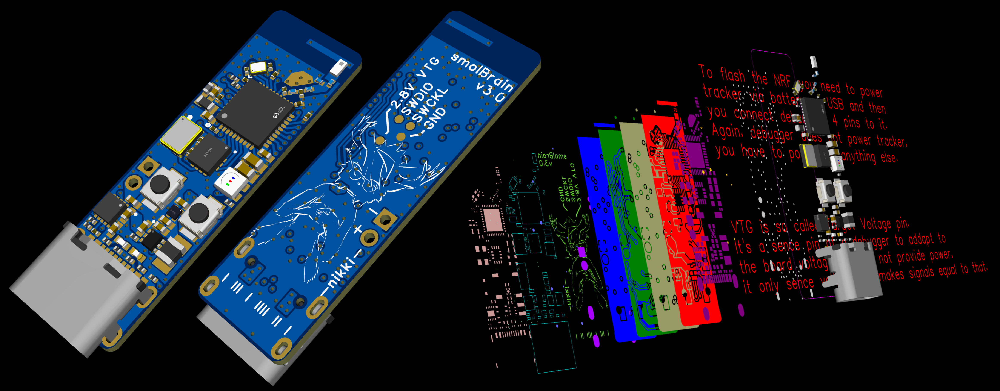
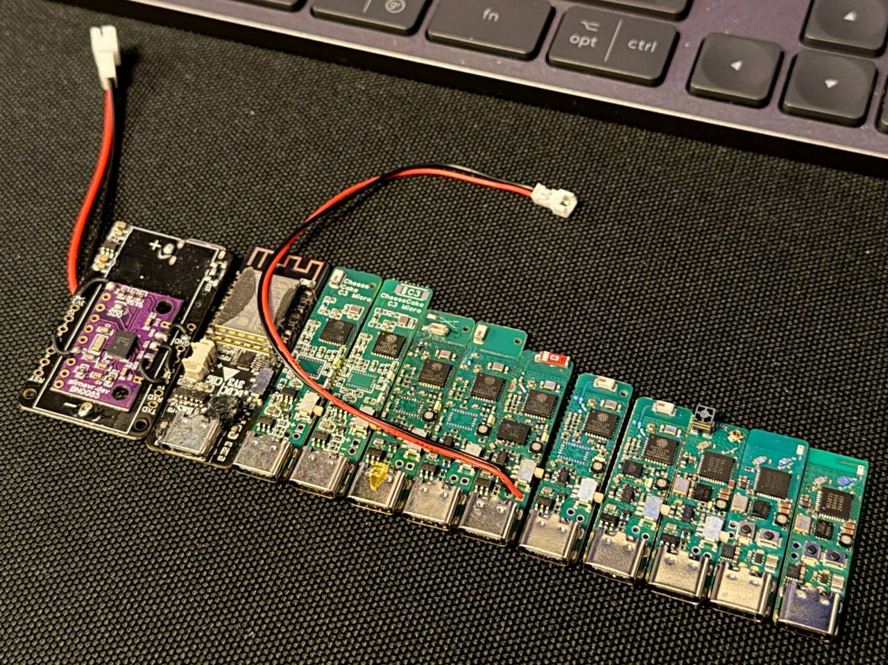
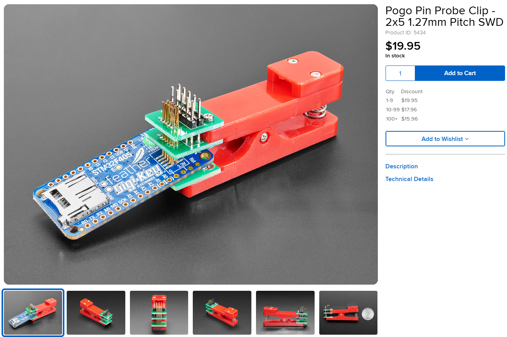
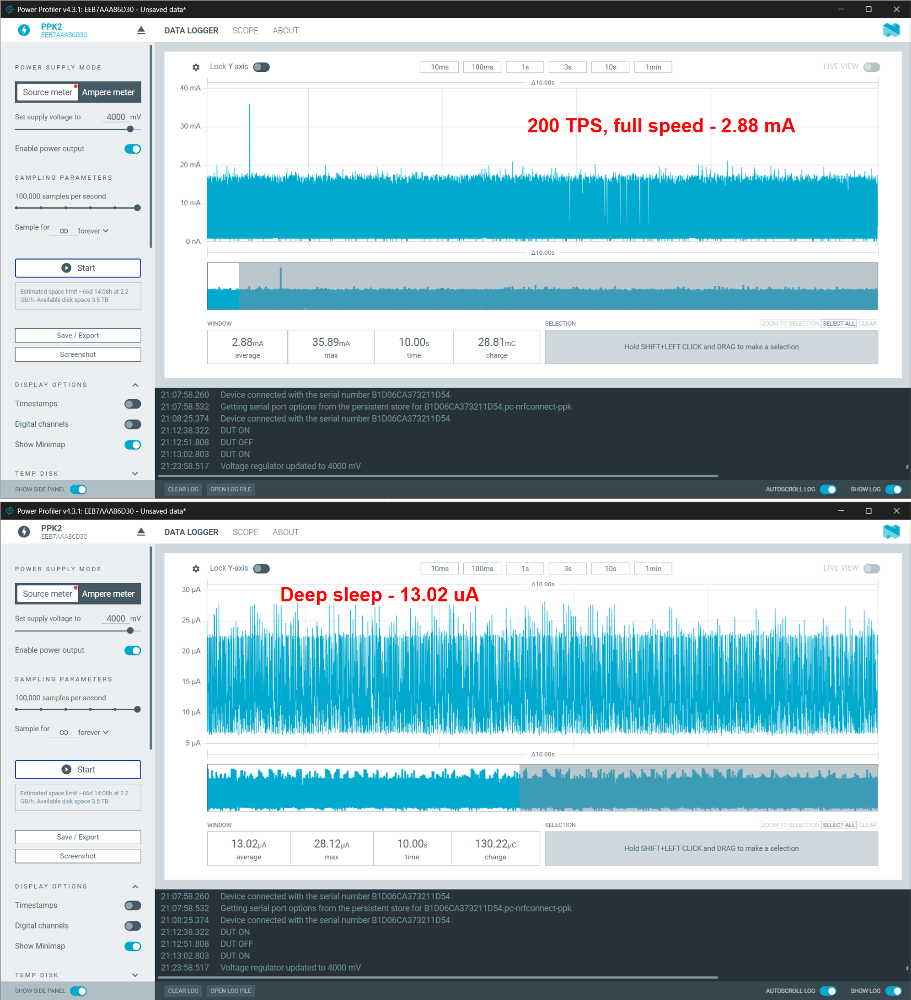
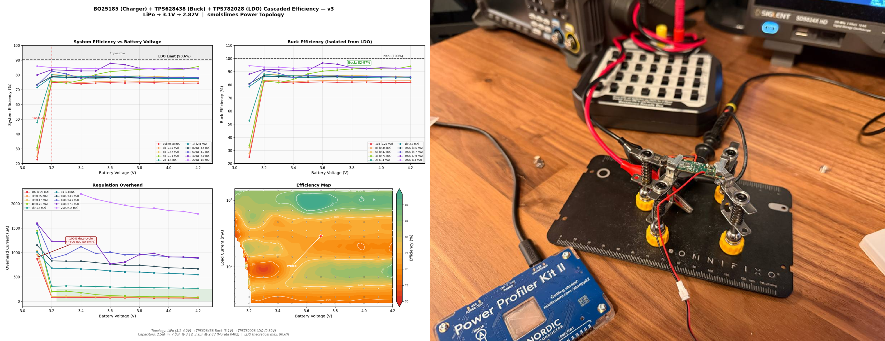
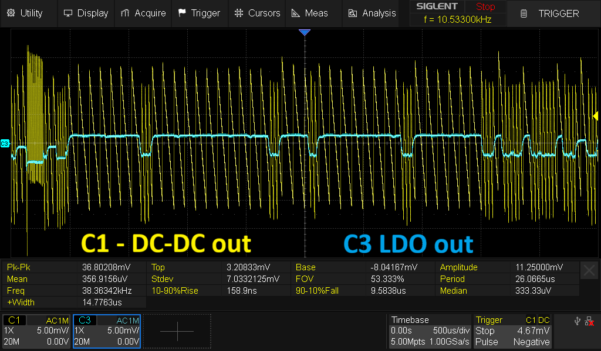
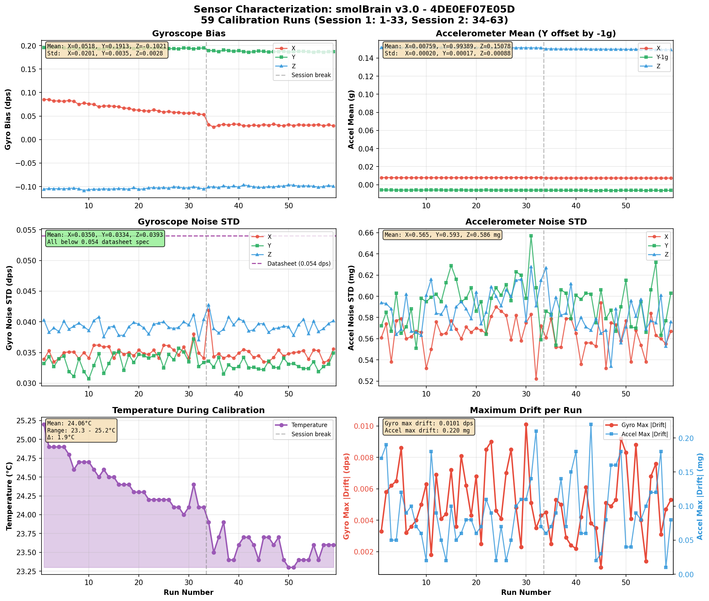

# Hi there! If not the tracker itself - check the schematic PDF! I have a ton of info there, could be interesting if you're searching for solutions with explanations why and how :3

# smolBrain V3.0

A custom PCB for SlimeVR nRF trackers (smolSlimes).

smolBrain is a fully integrated, 4-layer tracker board built around the nRF52833 and ICM-45686.

For general information on SlimeVR nRF trackers, firmware flashing, pairing, and calibration, see the official documentation: https://docs.slimevr.dev/smol-slimes/

# What is this and who am I (feel free to skip :3)

This tracker is my attempt to make the smallest tracker I can following all possible rules for routing, stackup, signal integrity and so on. Two limits were: as wide as USB-C allows and with components on one side. The BOM (price of all components together) is not optimized at all :3. Last time I ordered 15 of them from JLCPCB (15 trackers is supa small, you won't get any benefits of prices going down like with 100-unit orders) it was around 26.5 euro per piece. Expensive ICMs, only 15 units, stupid expensive components - but it's good :3

I'm an engineer, but started to make PCBs only a year and a half ago (mid of 2025) and I started with slimes. Thanks again to SoraKage for making a commission for me, which kind of pulled me into it 🤍. As I said, I'm not supa good at optimizing the price, but I'm trying to use the best components I can find and make the board as proper as possible. Below you can see that this one is not the first version I've made. I never released or sold them - just for me and maybe some friends. Everything I do, I'm also trying to test and document (you will find a ton of plots), even if it's sometimes incorrect or looks stupid.

So maybe not the tracker itself, but the description of it could be interesting to you. I'm kind of releasing it maybe not for people to make it (if you do, it will work, I use them, I've tested them, they're great :3), but maybe to learn or... to read and say - nikki is stupid. In that case, could you please send me a message or a commit? I'd love to know what's wrong :3

Here is a random pic with my old versions including ESP32-C3, BNO085, LSM6DSV and nRF with ICMs. The second and third trackers from the left were commissioned by SoraKage, thanks again a lot :3

---

## Contents

1. [Schematic](#1-schematic)
2. [Hardware](#2-hardware)
3. [Features](#3-features)
4. [Flashing](#4-flashing)
5. [Device testing results](#5-device-testing-results)
   - 5.1 [Power consumption](#51-power-consumption)
   - 5.2 [Power efficiency](#52-power-efficiency)
   - 5.3 [Power supply noise](#53-power-supply-noise)
   - 5.4 [Does leftover ripple affect IMU performance?](#54-does-leftover-ripple-affect-imu-performance)
   - 5.5 [IMU performance (ICM-45686)](#55-imu-performance-icm-45686)
6. [License](#6-license)

---

## 1. Schematic

I tried to put as much useful information into the schematic as I could. It's not just pinouts and component values - every block has notes explaining my reasoning, the measurements I took, and why I chose the values I did. It might look a little overwhelming at first, but the idea is that for each component you can see what my thought process was. Maybe it can be useful as a learning tool if you're designing something similar. It doesn't mean everything is perfect - there could be mistakes, and if you find any, feel free to let me know.

Below you can see just a preview of what I have inside :3 [schematic PDF](Nikki_smolBrain_V3.0_schematic.pdf).

---

## 2. Hardware

| Component | Part |
|-----------|------|
| MCU | nRF52833 (QIAA, 73-pin aQFN) |
| IMU | ICM-45686 (6-axis, SPI) |
| TCXO | SX3M32.768KB10F20TLN (32.768 kHz, ±10 ppm) |
| DCDC | TPS628438 (LiPo -> 3.1 V) |
| LDO | TPS7A2028 (3.1 V -> 2.8 V) |
| PCB | 4-layer stackup |
| Power rail | 2.8 V for all components |
| Battery | Single-cell LiPo (150 mAh typical) |

---

## 3. Features

| Feature | Description |
|---------|-------------|
| Precision clock | External TCXO at 32.768 kHz, ±10 ppm. Feeds both the nRF (LFCLK) and the IMU (CLKIN), providing accurate timing for sensor sampling and TDMA synchronization during light sleep. Controllable via a tri-state enable pin - firmware switches it off during deep sleep to save power. Current consumption is up to datasheet: ~7 µA with no load, ~12 µA with 1 MΩ load, ~1.3 µA when tri-state is pulled down. Since TCXO is used for nRF too - you must take care of proper switching to external and internal clock sources. At the moment I have a custom firmware but I believe in the future it will be properly implemented on the main branch of the smolSlimes. |
| Charger with power path and protection | LiPo charger with overvoltage/undervoltage protection. 100 mA max system current; 40 mA max charging current. White LED on = charging, both LEDs off = charged, white LED fast blinking = USB power but no battery (normal), red LED on = fault (check charger datasheet). |
| RGB LED | Directly controlled by the nRF for status indication (pairing, calibration, battery level, errors, etc.). |
| Active battery divider | Battery voltage sensing through a 1 MΩ / 1 MΩ divider with an active low-side switch - the ground side is connected to an nRF GPIO configured as open-drain. When released (high-Z), the divider is disconnected so there's no DC current path. There is still some leakage through the nRF pin's internal protection diode when battery voltage exceeds VDD (2.8 V), but much less than having ground always connected. |
| DCDC + LDO power topology | LiPo -> DCDC (3.1 V) -> LDO (2.8 V). Provides low ripple and relatively good efficiency for overall low power consumption. See [power supply noise measurements](#53-power-supply-noise) for details. |
| Ceramic antenna | Small ceramic antenna matched to the nRF52833 RF output. |
| Buttons | SW0 button and reset button for user interaction and board recovery. |

---

## 4. Flashing

A blank nRF52833 requires an SWD debugger for the initial flash. There is no built-in bootloader on a new chip.

### 4.1 What you need

Any SWD-capable debugger. Options include:

- **nRF52833 DK** - use the on-board J-Link as an external debugger
- **Raspberry Pi Pico** - flash with picoprobe/debugprobe firmware (~$4)
- **Raspberry Pi Debug Probe** - CMSIS-DAP, plug-and-play (~$12)
- **J-Link EDU Mini** or any standalone J-Link
- **ST-Link V2 clone** - works with OpenOCD (~$3-5)

### 4.2 Connections

Four wires from the debugger to the smolBrain SWD header:

| Pin | Function |
|-----|----------|
| SWDIO | Serial Wire Debug data |
| SWDCLK | Serial Wire Debug clock |
| GND | Ground |
| VTG | Voltage sense (target voltage reference - does not supply power) |

The board must be powered independently - either through USB-C or with a battery soldered on. The VTG pin only tells the debugger what logic level to use (2.8 V on this board).

To connect the debugger, you can use a pogo pin clip - a spring-loaded clip with pogo pin contacts that press against the SWD pads without soldering. Adafruit sells these. Pitch must be 1.27 mm.

### 4.3 First flash

Flash the bootloader included in the root of this repository [Adafruit Bootloader](firmware_files/feather_nrf52833_express_bootloader-0.9.2_s140_7.3.0.hex) via SWD. This only needs to be done once or if you bugged the tracker firmware somehow.

### 4.4 After first flash

Once the Adafruit nRF52 Bootloader is installed, all subsequent firmware updates can be done via UF2 drag-and-drop. To enter DFU mode, either double-click the reset button, or if you already have the smol slimes firmware running, send the `dfu` command through the terminal. Then copy the `.uf2` file to the USB drive that appears.

For firmware flashing instructions, see: https://docs.slimevr.dev/smol-slimes/firmware/smol-flashing-firmware.html

### 4.5 Special files for the board

As for any other board we must provide to the project so called devicetree and config files. Those are needed to tell proper pins and settings for my board.

First - go and grab [Board config files](firmware_files/smolBrain_rev3) and drop it right into the "boards" folder of the project. That folder contains all the pins and stuff for my board.

Second - copy [this yml](firmware_files/pm_static_nikkismolbrain_r3_uf2_nrf52833.yml) to the root of the project. You will see other similar yml files for other boards at the same place.

That is it - it should compile following docs steps.

---

## 5. Device testing results

This section contains real measurements from an actual smolBrain v3.0 board. Everything here is from a real device - not simulations, not theoretical calculations, just what the board actually does.

### 5.1 Power consumption

Measured at 4.0 V battery input with 150 mAh LiPo (0.6 Wh):

| Mode | Current | Power | Battery life (150 mAh) |
|------|---------|-------|------------------------|
| Active (200 TPS) | 2.88 mA | 11.52 mW | ~52 hours |
| Deep sleep | 13 µA | 0.052 mW | Months |

During actual use, the tracker isn't always transmitting at 200 TPS - the packet rate varies depending on how much you move, so real-world battery life will be longer than 52 hours.

### 5.2 Power efficiency

Overall efficiency of the chain **Charger-DCDC-LDO** is approximately 78% at typical operating loads (2 mA - 2.88 mA). Efficiency is measured from the **battery connector point** using a decade resistor box and with all components except power-related ones removed from the board. I don't say measurements were done up to the book, but I think it's pretty good enough :3

### 5.3 Power supply noise

The LDO stage produces an extremely clean power rail - below 1 mV peak-to-peak voltage ripple, plus whatever residual DC offset remains from the DCDC bias shift.

Why care about it? In the ICM-45686 datasheet it says "if your voltage ripples are above 50 mVpp - do something with it." On my previous version I had only DCDC. So it means I had that crazy 10 kHz - 40 kHz ramp noise which comes from DCDC going into power efficiency mode and charging the cap only when it's needed, which decreases switching frequency to just 10s of kHz which is almost impossible to filter out well enough using any small caps combo. Then I decided to add an LDO and if you compare IMU gyroscope and accelerometer noise - I'm sorry, but I can't tell that it actually helped a lot. It looks like it's better (previous version was giving me 0.04 dps and the new one with LDO maybe more around 0.038 dps). So, if you're thinking about your own board and you see 35 - 45 mVpp - it's ok, don't stress about it. Those numbers are completely fine for low power devices using DCDC and the IMU itself is pretty fine with that. LDO of course makes everything supa clean, but it's more components, a bit more expensive, you need an additional drop of 0.3 V at least to make sure the LDO can reject the noise and it could lead to the blue LED being kind of at the edge and not glowing in full if you had 3.1 V on DCDC and now you're dropping to 2.8 V. But whatever.

On the scope capture below, yellow is the DCDC output (LDO input) and blue is the LDO output. The leftover ripple you see on the blue line is from the DCDC voltage bias, which depends on current consumption. The DCDC keeps its output just a bit above target when current consumption is low, so that when it spikes it doesn't drop the voltage too low. That change is too low frequency for the LDO to filter out, and it's more or less normal behavior.

### 5.4 Does leftover ripple affect IMU performance?

As shown in [5.3](#53-power-supply-noise), the LDO output is extremely clean - below 1 mV peak-to-peak. But there are still leftover voltage shifts that the LDO can't filter out. When current consumption increases (nRF wakes up, starts processing, transmits), the voltage dips by about 5 mV and stays there until the load drops again. This is way too slow for the LDO to reject - it's basically a DC shift from its perspective. Normal DCDC behavior, nothing wrong with it.

The real question is: does the IMU sample during those dips, or does it mostly catch the flat parts?

***Measurement setup*** - The ICM-45686 has a data ready interrupt (INT) that pulses when a new sample is ready. The actual ADC sampling should happen just before this pulse, with minimal delay. So I triggered the scope on the INT pulse and looked at what was happening on the power rail right before it - that's the window where the IMU was most likely sampling. Probing: channel C1 on the ICM VDDP pin, ground on the decoupling cap ground pad - less than a millimeter from the chip. As close to what the IMU actually sees as possible. Channel C3 on the INT pin for triggering. Persistence mode with color grading enabled - red/warm = happens often, blue/cold = happens rarely.

***Results (I'm so sorry, I just realized bottom of the image is corrupted T__T, scope didn't save it properly)*** - Before the INT pulse (left side of the capture), the voltage is almost always flat - the red persistence traces sit in a tight band well below 1 mV peak-to-peak. That's where the IMU samples most of the time. After the INT pulse fires and the nRF kicks in, the voltage dips by a few millivolts as current draw increases - but by then, sampling is already done. The scope stats show Pk-Pk of ~5.5 mV and Stdev of ~1.6 mV, but that includes the full capture with all the load transients. During the quiet window before sampling, it's well under 1 mV. In roughly 90-95% of cases, the IMU is sampling on an extremely flat power rail. The remaining 5-10% you can still see blue persistence traces from random nRF activity landing right before the INT pulse - sometimes the timing just lines up and there's nothing you can do about it. So yes, it technically affects the measurement, but rarely.

***Does it matter?*** - My previous version with DCDC only was giving me about 0.04 dps gyro noise. This version with the supa clean LDO rail gives around 0.038 dps. Not a huge difference. So if you're designing your own board and you see 35-45 mVpp on a DCDC-only rail - don't stress about it. The ICM-45686 datasheet says to take action above 50 mVpp, and anything well below that is fine.

### 5.5 IMU performance (ICM-45686)

There were some problems with the software (I think at the moment of you reading this, will anyone read it? :3) and I went crazy trying to measure and test raw IMU performance. In the end we found the problem but I've got some measurements which you can treat as a reference for what you can get.

Test conditions: tracker lying flat on a table, gyro at 200 TPS, accel at 100 TPS, TCXO on CLKIN, DCDC + LDO power rail. 59 calibration runs across two sessions - first session the sensor was cooling down from ~25°C to ~24°C, second session it was stable at ~23.6°C.

**Gyroscope noise:**

| Axis | Measured STD | Datasheet spec |
|------|-------------|----------------|
| X | 0.035 dps | 0.054 dps |
| Y | 0.033 dps | 0.054 dps |
| Z | 0.039 dps | 0.054 dps |

Datasheet says you can get 0.054 dps - looks like it should be easy to get 0.035-0.039 dps. That's about 26-35% better than spec.

**Accelerometer noise:**

| Axis | Measured STD | Expected at 100 Hz ODR |
|------|-------------|------------------------|
| X | 0.565 mg | ~0.49 mg |
| Y | 0.593 mg | ~0.49 mg |
| Z | 0.586 mg | ~0.49 mg |

Acceleration noise for 100 Hz ODR should be around 0.49 mg (70 µg/√Hz × √50), I have 0.56-0.59 mg. About 15-20% above spec but still good - within normal variation.

**Temperature sensitivity:**

You can also see how the sensor cools down just a bit and it causes gyro bias to drift. Linear regression over the cooling session gives these temperature coefficients:

| Axis | Slope | Datasheet spec | vs Spec |
|------|-------|----------------|---------|
| X | 31.7 mdps/°C | ±5 mdps/°C | 6× worse |
| Y | 0.8 mdps/°C | ±5 mdps/°C | ✓ within spec |
| Z | 3.1 mdps/°C | ±5 mdps/°C | ✓ within spec |

The worst slope I have is 31.7 mdps/°C on X which is like really bad :3. But maybe I've soldered it bad or whatever. In any case - if I have it, other people can have it too, so even for smolSlimes where we don't have a constant heat coming from ESP (old wifi version), wear or temp calibration is a must.

---

## 6. License

Copyright (c) 2026 nikki

This source describes Open Hardware and is licensed under the CERN-OHL-S v2.

You may redistribute and modify this source and make products using it under the terms of the [CERN-OHL-S v2](https://ohwr.org/cern_ohl_s_v2.txt).

This source is distributed WITHOUT ANY EXPRESS OR IMPLIED WARRANTY, INCLUDING OF MERCHANTABILITY, SATISFACTORY QUALITY AND FITNESS FOR A PARTICULAR PURPOSE. Please see the CERN-OHL-S v2 for applicable conditions.

Source location: https://github.com/nikki-uwu/smolBrain

As per CERN-OHL-S v2 section 4, should you produce hardware based on this source, you must where practicable maintain the source location visible on the external case of the product.